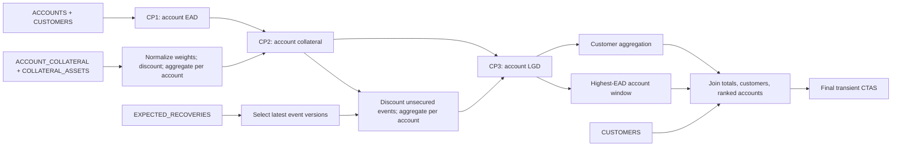

# Snowflake EAD/LGD query-profile demo

A standalone Gradle/Scala/Snowpark project that generates five real Parquet inputs,
loads them into Snowflake, runs three native `DataFrame.cacheResult()` checkpoints,
and executes a customer-level `CREATE TRANSIENT TABLE ... AS SELECT`. The live
single-run ScalaTest executes exactly three checkpoints and one final CTAS, with
correctness and actual operator-profile evidence. A separate determinism suite
runs the job twice over the same loaded inputs and compares the outputs.

**This is an invented educational EUR model, not a validated regulatory,
accounting or production credit-risk implementation.**

## Build and run locally

Install JDK 17. The wrapper downloads Gradle; no Scala, Hadoop, Spark, Python or
separate Gradle installation is needed. First use needs Maven Central and Gradle
distribution access. Later builds can use Gradle's dependency cache.

```bash
# macOS example; elsewhere point JAVA_HOME at your JDK 17.
export JAVA_HOME=$(/usr/libexec/java_home -v 17)
./gradlew offlineTest
./gradlew test
# test also discovers and explicitly skips the gated live tests.
./gradlew generateFixtures                  # 100,000 customers; no Snowflake
CUSTOMER_COUNT=100 ./gradlew generateFixtures
./gradlew installDist                       # application scripts + jars
```

```powershell
$env:JAVA_HOME = 'C:\Program Files\Java\jdk-17'
.\gradlew.bat offlineTest
.\gradlew.bat test
.\gradlew.bat generateFixtures
$env:CUSTOMER_COUNT = '100'
.\gradlew.bat generateFixtures
Remove-Item Env:CUSTOMER_COUNT
.\gradlew.bat installDist
```

`offlineTest` excludes all live suites, including the profile exporter, and forces the gate off. `test` discovers
ScalaTest suites through `@RunWith(JUnitRunner)` and Gradle `useJUnit()`. With no
`RUN_SNOWFLAKE_IT=true`, integration cancels before reading connection settings or
opening a session. After opt-in, missing settings, authentication failures and
load failures fail the test. A skipped live test is **not** live acceptance.
Reports are under `build/reports/tests/test/` or `offlineTest/`.

The installed application is in
`build/install/snowflake-ead-lgd-profile-demo/bin/`; pass `generate` for local files,
or `run` for one complete gated execution: three checkpoints and one final CTAS.
`./gradlew run --args=run` is equivalent. To execute this through ScalaTest, use
`EadLgdSnowflakeSingleRunTest` as shown below.

## Pinned version matrix

| Component | Version |
| --- | --- |
| Gradle wrapper | 8.14.3, distribution SHA-256 verified |
| JDK toolchain / compiler Java API release | 17 |
| Scala / binary version | 2.12.20 / 2.12 |
| Snowpark Scala | 1.21.0 |
| Snowflake JDBC | 3.24.2, matching Snowpark's published POM |
| Apache Parquet / Avro | 1.15.2 / 1.12.0 |
| Hadoop JVM API dependencies | 3.4.1 common and mapreduce-client-core |
| Jackson | 2.18.0, matching Snowpark |
| ScalaTest / ScalaTestPlus JUnit | 3.2.19 / 3.2.19.0 |
| JUnit | 4.13.2 |

Scala 2.12 emits Java 8 class files even with its Java API release set to 17;
compilation, tests and the documented runtime use JDK 17.

`LocalParquet` uses NIO `OutputFile`/`InputFile` and `PlainParquetConfiguration`.
Writing streams into 8 MiB row groups, with dictionary encoding and uncompressed
Parquet. Hadoop classes satisfy Parquet's JVM signatures; local I/O uses no Hadoop
filesystem, installation, cluster or `winutils.exe`. Writers close before hashing.
PUT uses quoted file URIs with literal spaces and forward slashes, including the
pinned JDBC driver's `file://C:/...` drive form on Windows. Project paths must not
contain apostrophes or wildcard characters, which this driver's PUT parser cannot
handle as literal filenames.

Snowpark 1.21.0's published source was inspected for caching, upload, query tags
and configuration. Native caching in this version emits an empty temporary CREATE
and an INSERT SELECT; the INSERT is the data query. See the official
[prerequisites](https://docs.snowflake.com/en/developer-guide/snowpark/scala/prerequisites)
and [DataFrame APIs](https://docs.snowflake.com/en/developer-guide/snowpark/scala/working-with-dataframes).

## Connection configuration

Use an existing warehouse and explicitly supplied sandbox database/schema. The
application creates no warehouse, database, schema, role or grant and never resizes
a warehouse. Use an existing **X-Small** warehouse for this run. The connection
setting takes its warehouse name, not the string `X-Small`.

Copy `snowflake.example.properties` to ignored `snowflake.properties`, or use
environment variables. `SNOWFLAKE_CONFIG` selects another local file. Environment
values override file values. Existing `account`, `user`, `private_key_path` and
`private_key_passphrase` names from `connect/snowflake_connection.py` are supported;
that independent helper is never called by Scala. Properties use UTF-8 literal
`key=value` entries, comments and literal backslashes, without Java escape parsing.

| Environment | Properties key | Snowpark / JDBC mapping |
| --- | --- | --- |
| `SNOWFLAKE_ACCOUNT` | `account` | `ACCOUNT`; derives host if URL absent |
| `SNOWFLAKE_URL` | `url` | validated HTTPS/JDBC/host URL → `URL=host[:port]` |
| `SNOWFLAKE_USER` | `user` | `USER` |
| `SNOWFLAKE_ROLE` | `role` | `ROLE` |
| `SNOWFLAKE_WAREHOUSE` | `warehouse` | `WAREHOUSE` |
| `SNOWFLAKE_DATABASE` | `database` | `DB` |
| `SNOWFLAKE_SCHEMA` | `schema` | `SCHEMA` |
| `SNOWFLAKE_PRIVATE_KEY_PATH` | `private_key_path` | `PRIVATE_KEY_FILE`; selects `snowflake_jwt` |
| `SNOWFLAKE_PRIVATE_KEY_PASSPHRASE` | `private_key_passphrase` | `PRIVATE_KEY_FILE_PWD` |
| `SNOWFLAKE_AUTHENTICATOR` | `authenticator` | `AUTHENTICATOR`: `snowflake` or `externalbrowser` without key file |
| `SNOWFLAKE_PASSWORD` | `password` | `PASSWORD` with `snowflake` authentication |

User, role, warehouse, database and schema are mandatory; supply account or URL.
URLs cannot contain credentials/query parameters. SQL names must be ordinary
unquoted identifiers; mixed-case quoted names are unsupported. Relative key paths
resolve against the configuration file directory; `~/` expands. Use a registered
PKCS#8 RSA key supported by the pinned JDBC driver. Key authentication takes
priority over password/browser settings. For browser login omit the key path.
Never commit keys, passphrases or passwords.

Actual test/application JVMs include `--add-opens=java.base/java.nio=ALL-UNNAMED`
for Arrow/JDK 17. If an encrypted OpenSSL key needs JDBC's bundled Bouncy Castle,
set `JAVA_TOOL_OPTIONS=-Dnet.snowflake.jdbc.enableBouncyCastle=true` (JDBC 3.x).
TLS and OCSP checks remain enabled. See
[JDBC key-file properties](https://docs.snowflake.com/en/developer-guide/jdbc/jdbc-configure).

The role needs USAGE on the supplied warehouse, database and schema, plus CREATE
TABLE, CREATE VIEW and CREATE STAGE on the schema. It operates on its own objects.
Operator evidence also requires **MONITOR or OPERATE on the warehouse**. No
ACCOUNTADMIN role or automatic grants are requested.

## Complete job through ScalaTest: three checkpoints and one CTAS

The configured environment for this workspace is role `SYSADMIN`, existing
X-Small warehouse `SCALING_BENCH_WH`, database `RISKDEMO` and schema
`EAD_LGD_DEMO`. The database/schema were provisioned separately using
[the setup worksheet](sql/setup-riskdemo.sql); their creation is not part of the
business job. The ignored local `snowflake.properties` contains this context.

Set connection/authentication first. For the existing local key configuration,
supply the sandbox context if it is not already in your local properties file:

```bash
export SNOWFLAKE_ROLE=SYSADMIN
export SNOWFLAKE_WAREHOUSE=SCALING_BENCH_WH
export SNOWFLAKE_DATABASE=RISKDEMO
export SNOWFLAKE_SCHEMA=EAD_LGD_DEMO

RUN_SNOWFLAKE_IT=true CUSTOMER_COUNT=100000 KEEP_OBJECTS=true \
REQUIRE_QUERY_PROFILES=true \
./gradlew test --tests '*EadLgdSnowflakeSingleRunTest' --rerun-tasks --info

# Smaller live smoke run; not default-scale acceptance.
RUN_SNOWFLAKE_IT=true CUSTOMER_COUNT=100 KEEP_OBJECTS=false \
./gradlew test --tests '*EadLgdSnowflakeSingleRunTest' --rerun-tasks
```

```powershell
$env:SNOWFLAKE_ROLE = 'SYSADMIN'
$env:SNOWFLAKE_WAREHOUSE = 'SCALING_BENCH_WH'
$env:SNOWFLAKE_DATABASE = 'RISKDEMO'
$env:SNOWFLAKE_SCHEMA = 'EAD_LGD_DEMO'
$env:RUN_SNOWFLAKE_IT = 'true'
$env:CUSTOMER_COUNT = '100000'
$env:KEEP_OBJECTS = 'true'
$env:REQUIRE_QUERY_PROFILES = 'true'
.\gradlew.bat test --tests '*EadLgdSnowflakeSingleRunTest' --rerun-tasks --info

# Smaller live smoke run:
$env:CUSTOMER_COUNT = '100'
$env:KEEP_OBJECTS = 'false'
.\gradlew.bat test --tests '*EadLgdSnowflakeSingleRunTest' --rerun-tasks
```

These commands start billable queries. Each single-run test generates and loads
all five inputs, performs **one full job execution: CP1 → CP2 → CP3 → FINAL_CTAS**,
and validates the result. It produces one final customer table. Ingestion,
validation and observability issue additional SQL statements; the three
checkpoints and one CTAS describe the business pipeline.

For the original determinism acceptance, select the separate suite:

```bash
RUN_SNOWFLAKE_IT=true CUSTOMER_COUNT=100000 KEEP_OBJECTS=true \
REQUIRE_QUERY_PROFILES=true \
./gradlew test --tests '*EadLgdSnowflakeIntegrationTest' --rerun-tasks --info
```

On Windows, with the same environment variables set:

```powershell
.\gradlew.bat test --tests '*EadLgdSnowflakeIntegrationTest' --rerun-tasks --info
```

That suite executes the complete job twice (six checkpoints and two final CTAS
statements in total) and compares both outputs. With the live gate enabled,
unfiltered `test` runs both live suites. Use the exact single-run filter above for
one execution. Validation overhead is substantial; these are not pure performance
benchmarks.

| Setting | Default | Meaning |
| --- | --- | --- |
| `RUN_SNOWFLAKE_IT` | `false` | exact `true` opts into Snowflake |
| `CUSTOMER_COUNT` | `100000` | 10–1,000,000; exactly 3 accounts each |
| `DATA_SEED` | `20251130` | signed 64-bit seed |
| `REPORTING_DATE` | `2025-11-30` | ISO date |
| `KEEP_OBJECTS` | `false` | retain the final transient output(s) only |
| `REQUIRE_QUERY_PROFILES` | `true` | missing profile evidence fails acceptance |
| `COLLATERAL_DISCOUNT_BPS` | `500` | annual asset rate, 0–10,000 |
| `STATEMENT_TIMEOUT_SECONDS` | `1800` | 60–86,400, dedicated session |

## Data and pipeline

Default scale: 100,000 customers, 300,000 accounts, about 180,000 assets, 360,000
links and 585,000 recovery rows (about 600,000). Stable keyed generation uses a
fixed seed, deterministic IDs and order; wall-clock time never affects business
values. UUIDs isolate operational run names. The first four customers form a
fixed, independently calculable cohort. See [schemas and keys](docs/input-schema.md)
and [model, rounding and reference cohort](docs/model.md).

Five files are generated under `build/ead-lgd/<run-id>/input/`. Their manifest
records schemas, nullability, row counts, sizes and SHA-256 hashes. Every file is
uploaded into a run-specific internal-stage path, then loaded into explicit NOT
NULL landing tables. COPY uses exact filenames, case-sensitive column matching
and `ON_ERROR=ABORT_STATEMENT`, without a COPY SELECT transformation. PUT/COPY
results, actual counts, nulls, physical keys, foreign keys, domains and
same-customer asset sharing are verified before a `LOADS_COMPLETE` boundary permits
the job to start. No business joins or aggregations execute locally.



This is a **logical dependency diagram**, not a Snowflake execution profile.

## Query IDs and profiles

One dedicated, non-shared session is tagged with job, run, execution (`E1`/`E2`)
and phase. `USE_CACHED_RESULT=FALSE` controls persisted query-result reuse; it does
not disable explicit Snowpark caching. Each checkpoint consumes the preceding
cached DataFrame. Cache handles remain alive through dependent actions/validation.

The profiler polls `QUERY_HISTORY_BY_SESSION`, including client-generated SQL,
with bounded server timestamps, session ID, exact phase tag and result limit
10,000. It records associated statements, finds created targets, and selects data
INSERT/CTAS statements matching them. Empty CREATE, ALTER, metadata, COUNT and
history queries cannot qualify. No `LAST_QUERY_ID()` guess or invented listener is
used. Final CTAS is explicit SQL against a still-lazy temporary view and is saved
before execution. No final result is materialized before CTAS.

`GET_QUERY_OPERATOR_STATS(actual_id)` exports returned operator IDs/types,
parents, statistics and execution-time details. History includes text, tags,
timestamps, status and elapsed time. Post-action COUNT checks establish business
rows; CTAS command-result row counts are not interpreted as customers written.

In Snowsight open **Monitoring → Query History** (also called Activity → Query
History in some UI versions), find a printed query ID, open details and choose
**Query Profile**. Repeat for CP1, CP2, CP3 and FINAL_CTAS in each execution.
Each profile describes one query; upstream checkpoint work has separate profiles.
Three checkpoints are a demo requirement, not a prerequisite for a profile graph.
Exact physical shapes and timings depend on the optimizer and are never invented.

Information Schema history covers seven days; operator statistics cover eligible
completed queries from the past fourteen days. Export promptly. Missing
permissions/availability are recorded with the underlying error; default profiling
acceptance fails. Explicit `REQUIRE_QUERY_PROFILES=false` allows correctness-only
completion and reports `profilesVerified=false`. See official
[query history](https://docs.snowflake.com/en/sql-reference/functions/query_history),
[operator statistics](https://docs.snowflake.com/en/sql-reference/functions/get_query_operator_stats)
and [Snowsight history](https://docs.snowflake.com/en/user-guide/ui-snowsight-activity).

## Export a query profile to yEd GraphML through ScalaTest

`QueryProfileGraphmlExportTest` takes an existing query ID, reads its operator
statistics from Snowflake and writes a `.graphml` file. It uses the same local
connection configuration. It does not regenerate inputs or execute the original
query. For the demonstrated CTAS:

```bash
RUN_SNOWFLAKE_IT=true ./gradlew test \
  --tests '*QueryProfileGraphmlExportTest' \
  -PqueryId=01c73375-0005-833e-0001-91ae00232802 --rerun-tasks
```

PowerShell:

```powershell
$env:RUN_SNOWFLAKE_IT = 'true'
.\gradlew.bat test --tests '*QueryProfileGraphmlExportTest' `
  -PqueryId=01c73375-0005-833e-0001-91ae00232802 --rerun-tasks
```

Output:

```text
build/query-profiles/01c73375-0005-833e-0001-91ae00232802.graphml
build/query-profiles/01c73375-0005-833e-0001-91ae00232802.operators.json
```

Use **File → Open** in yEd to open the `.graphml` file. Each execution step has
its own group: this CTAS has one creation operator in Step 1 and twelve operators
in Step 2. The file includes node positions, colors, arrows and row counts.
Arrows point from each input operator to its consuming parent, as in Snowsight.
Operator IDs are scoped by step, and shared branches retain every parent edge.
Full operator and table/object names appear on the nodes without abbreviation.
Full SQL expressions, attributes, statistics and timing breakdowns are retained
in node properties and descriptions. These are the physical names reported by
Snowflake, including generated temporary-table names. Percentages refer to the
individual step. Other checkpoint queries require their own exports.

Optional inputs: `-PqueryProfileOutput=/path/profile.graphml`, or environment
variables `QUERY_ID` and `QUERY_PROFILE_OUTPUT`. Gradle properties take precedence.
Both a bare UUID and the copied heading `Query - <UUID>` are accepted. In IntelliJ,
run `QueryProfileGraphmlExportTest` with environment variables
`RUN_SNOWFLAKE_IT=true` and `QUERY_ID=<UUID>`, using the project root as the working
directory and the existing JDK/connection setup. Without a query ID the export
test skips; invalid IDs fail before connecting.

The `.operators.json` sidecar preserves the source evidence. The pure Scala API
`QueryProfileGraphml.write(queryId, Json.mapper.readTree(jsonFile), outputPath)`
can also render a previously saved profile without connecting. Eligible profiles
are available from Snowflake for fourteen days and require the documented
warehouse privileges; expired/unavailable statistics fail the live export.
See [Snowflake operator statistics](https://docs.snowflake.com/en/sql-reference/functions/get_query_operator_stats)
and [yWorks GraphML format](https://docs.yworks.com/yfiles/doc/developers-guide/graphml.html).

## Artifacts and lifecycle

Live run artifacts under `build/ead-lgd/<run-id>/`:

```text
input/*.parquet
fixture-manifest.json
load-results.json
query-manifest.json
profiles/E1-<phase>-<query-id>.json     # E2 also present in determinism suite
sql/executed-ctas.sql                 # actual CTAS statement(s)
sql/E1-executed-ctas.sql               # E2 also present in determinism suite
sql/inspect-queries.sql               # actual query IDs; runnable
sql/cleanup.sql                       # exact registered objects only
validation-summary.json
run-summary.md
```

Artifacts update during execution and preserve partial failures. Final columns
include customer/date, attributes, counts, drawn/undrawn totals, EAD, capped
recovery, LGD amount, EAD-weighted LGD, PD, illustrative expected loss, top account
and quality counts. There are no operational IDs/timestamps among business columns.
Validation checks account grain at every checkpoint, bounded intermediates,
allocation conservation, numerical limits, customer/account reconciliation, the
hand-calculated cohort. The determinism suite additionally checks bidirectional
SQL MINUS between fresh executions.
Counts and uniqueness are checked separately, so set comparisons cannot hide
duplicates. Full outputs are never collected locally.

Default cleanup drops all registered objects. `KEEP_OBJECTS=true` retains only the
final transient table (two in the determinism suite); run generated
`sql/cleanup.sql` when finished.
Temporary checkpoints, inputs, views and stage end with the session and are also
explicitly cleaned up where registered. Retaining final outputs cannot retain
checkpoint data. Cleanup uses exact registered names and preserves the original
exception if cleanup also fails.

## IntelliJ IDEA

1. Install the Scala plugin and open this directory as a Gradle project.
2. Select JDK 17 for Project SDK and Gradle JVM; use the committed wrapper.
3. Reload Gradle. Set build/run and test runners to Gradle.
4. Run `offlineTest`. For live tests add documented connection variables and
   `RUN_SNOWFLAKE_IT=true` to the Gradle run configuration.
5. Set the working directory to this project root. Direct IntelliJ ScalaTest or
   Application runs need `--add-opens=java.base/java.nio=ALL-UNNAMED` in VM options;
   Gradle already supplies it. Do not edit wrapper batch scripts.

Code lives in `src/main/scala/eadlgddemo`; tests in `src/test/scala/eadlgddemo`.
[VALIDATION.md](VALIDATION.md) distinguishes checks actually executed locally from
live Snowflake acceptance.
